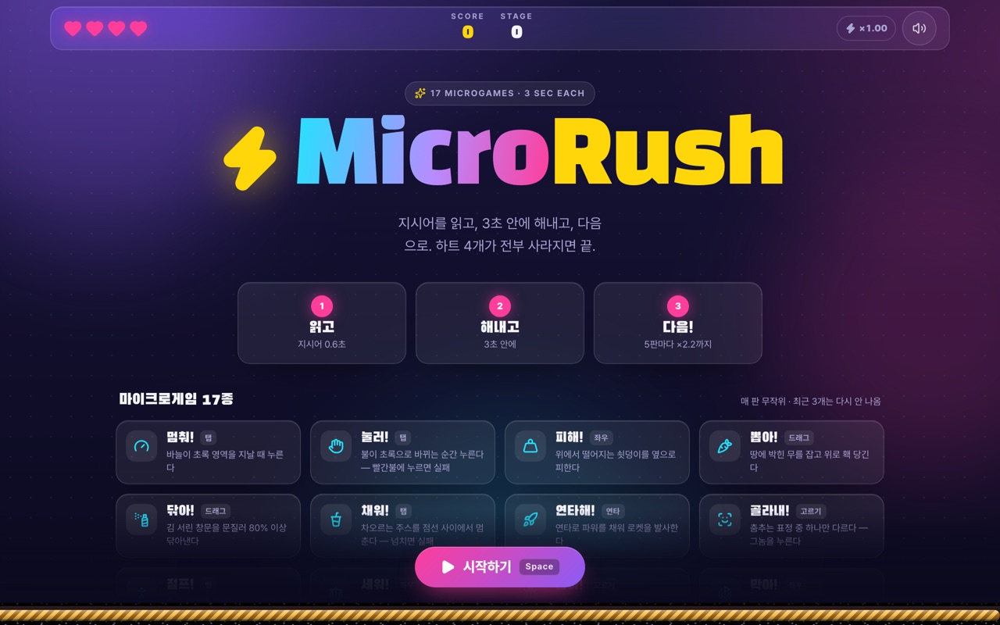
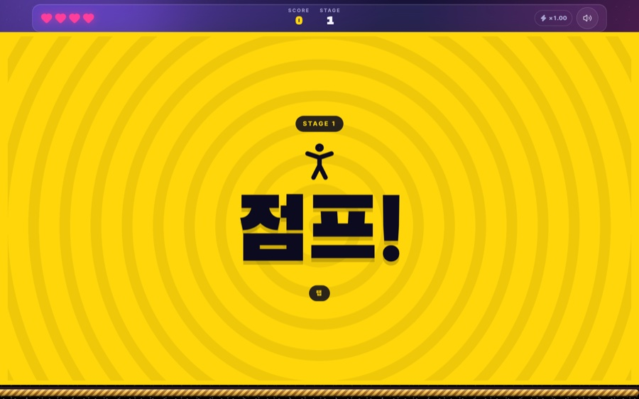
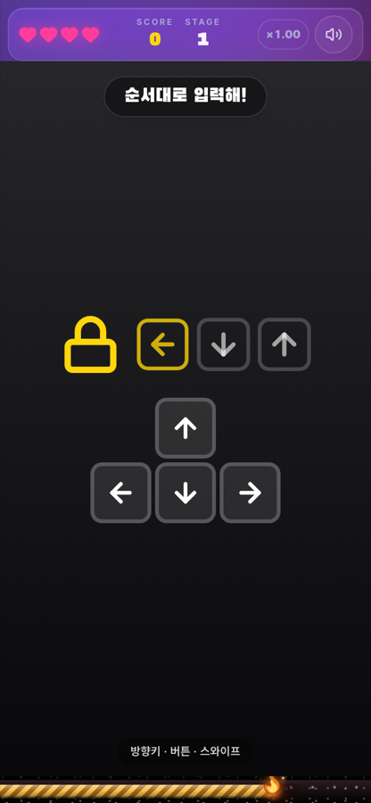
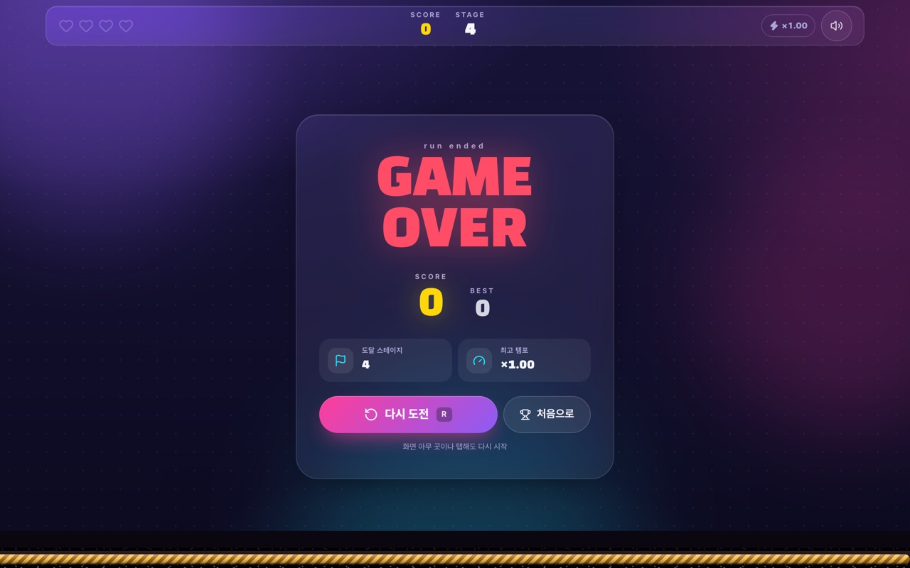

# MicroRush

> 와리오웨어식 초스피드 마이크로게임 플랫폼. **지시어 0.6초 → 3초 플레이 → 피드백 0.7초 → 다음.** 마이크로게임 17종. 외부 에셋 0개 — 그림은 CSS·Lucide, 소리는 Web Audio 합성.

### [▶ 브라우저에서 바로 플레이](https://xgeekover.github.io/microrush/)

설치 없이 데스크톱(마우스 · 키보드)과 폰(터치) 모두에서 된다. 소리는 첫 탭/클릭 뒤에 난다. 기록은 각자의 브라우저에만 저장된다.



<p align="center"> &nbsp;  &nbsp; </p>

## 실행

```bash
npm install
npm run dev      # http://localhost:5173
npm run build    # tsc -b && vite build
npm run lint     # oxlint
```

### 배포

`main` 에 push 하면 GitHub Actions(`.github/workflows/deploy.yml`)가 린트 → 빌드 → GitHub Pages 배포까지 한다. Pages 는 `https://<user>.github.io/microrush/` 하위 경로에서 서빙되므로 `vite.config.ts` 의 `base` 가 상대 경로(`./`)다.

## 조작

| 입력 | 동작 |
|---|---|
| `Space` / `Enter` / 클릭 / 탭 | 로비에서 시작 · 게임 안에서 "누르기" · 게임 오버에서 다시 |
| `R` | 게임 오버 화면에서 다시 |
| `←` `→` / `A` `D` / 마우스 이동 / 드래그 | "피해!" 에서 좌우 이동 |
| 마우스 드래그 (위로) | "뽑아!" — 무를 누른 채 위로 홱 |
| 마우스 문지르기 (호버 · 드래그) | "닦아!" — 커서가 지나간 타일이 지워진다 |
| 클릭 / 탭 (대상 지정) | "골라내!" — 다른 하나를 누른다 |
| `M` / 우상단 버튼 | 음소거 |
| 게임 오버의 "처음으로" | 로비로 돌아간다 (다시 도전은 곧바로 새 판) |

## 코어 루프

```
LOBBY ─시작─▶ READY(지시어 0.6s) ─▶ PLAYING(3~4s ÷ 템포) ─▶ RESULT(피드백 0.7s) ─┬─▶ READY (다음 게임)
                                                                               ├─▶ SPEED_UP(1.0s) ─▶ READY   5클리어마다
                                                                               └─▶ GAMEOVER (하트 0)  ─▶ READY
```

- 하트 4개. 실패 또는 시간 초과마다 1개. 0이면 게임 오버 → 결과 모달(이번 점수 · 역대 최고 · 다시 도전). 최고 기록과 음소거 설정은 LocalStorage(`src/utils/storage.ts`, 정제 · 실패 내성).
- 5스테이지 클리어마다 `SPEED UP!!` — 템포 배율이 사다리를 오른다: **1.0 → 1.2 → 1.45 → 1.7 → 1.95 → 2.2**(끝에서 고정). 제한 시간은 `기본 시간 ÷ 배율`(하한 1.1초), 째깍 간격·도화선·게임 내부 속도(바늘·낙하·신호 대기)도 배율을 따른다.
- 판정은 `GameController` 의 reducer 한 곳에서 일어난다. 마이크로게임이 `onSuccess`/`onFail` 을 몇 번 부르든 `PLAYING` 이 아닐 때의 판정은 무시되므로 스테이지당 정확히 한 번이다.
- 추첨은 **최근 3개**를 빼고 균등(`pickNextGame`). 직전 하나만 빼면 17종에서도 같은 게임이 두세 판 걸러 자주 돌아온다.
- 템포 상수는 전부 `src/core/config.ts`. 한 판의 시계는 `useGameLoop`(rAF) — 도화선 비율을 매 프레임 주고, 째깍 시점(`tickIntervalMs`: 여유 500ms → 마지막 90ms, ÷배율, 하한 60ms)과 시간 초과를 콜백으로 알린다.

## 사운드 (`src/core/SoundManager.ts`)

오디오 파일 없이 Web Audio API 로 합성한다. 첫 사용자 입력(시작 · 재도전)에서 `unlock()` 이 컨텍스트를 만들고 `resume()` 한다.

| 소리 | 합성 |
|---|---|
| 째깍 | 800Hz / 1200Hz 삼각파를 번갈아, 35ms. 남은 시간이 줄수록 간격이 촘촘해진다 |
| 경고 | 마지막 20% 는 1600Hz(+옥타브) 사각파 비프 70ms 로 바뀐다 |
| 성공 | C5 → E5 → G5 사인파, 90ms 간격, 마지막 음은 길게 |
| 실패 | 톱니파 130 → 50Hz 200ms + 600Hz 로우패스 + 60Hz thump |
| 지시어 | 노이즈 버스트 50ms + 150 → 60Hz 사인 thump |
| SPEED UP | 사각파 상승 아르페지오 C5…G6 + 트릴 (8비트 치프튠, 0.74s) |
| 도화선 펑 | 노이즈 30ms + 220 → 70Hz 팝 — 시간 초과 순간, 판정음 직전 |

모든 이벤트는 `sound.log`(최근 200개, `{event, t, ratio}`)에 남는다. 음소거여도 기록되므로 헤드리스 검증이 소리 대신 이 로그로 째깍 가속을 확인한다. 개발 빌드에서는 `window.__microrush.sound` 로 열려 있다.

## 화면 디자인 (`src/index.css` · `src/components/Lobby.tsx` · `src/games/ui.tsx`)

짙은 남보라 바탕에 네온 강조 5색(노랑 · 핑크 · 시안 · 초록 · 빨강), 반투명 유리 패널, 큰 라운드, 두 벌의 글꼴 — 지시어 · 제목 · 숫자는 **Black Han Sans**, 본문은 **Pretendard**(둘 다 OFL, CDN 에서 받고 실패하면 시스템 폰트). 색 · 글꼴 · 애니메이션은 `index.css` 의 `@theme` 토큰과 `@utility` 조각(`glass` · `chip` · `btn-primary` · `btn-ghost` · `kbd-hint`)으로만 쓰고 컴포넌트에 hex 를 적지 않는다.

- **로비** — 제목 → 한 줄 설명 → 세 단계(읽고 · 해내고 · 다음) → 게임 17종 카드(아이콘 · 조작 종류 · 설명) → 조작 안내. **시작 버튼은 스크롤과 무관하게 항상 아래에 떠 있다**(스크롤 컨테이너 안의 `sticky bottom-0`). 화면 어디를 눌러도 시작하되, 카드 영역은 읽는 곳이라 눌러도 시작하지 않는다.
- **HUD** — 노치 아래로 내려앉는 유리 바. 하트(마지막 하나는 맥동) · SCORE · STAGE · 템포 알약 · 44px 음소거 버튼.
- **지시어 배너** — 노란 바탕에 퍼지는 동심원, 게임 아이콘, 아주 큰 지시어, 그리고 **조작 종류 알약**(탭 · 홀드 · 드래그 · 좌우 · 연타 · 고르기 · 화살표) — 처음 보는 게임이라도 손이 먼저 간다.
- **게임 안** — 17종의 지시문과 힌트는 `Instruction` · `Hint` 두 조각으로 통일했다. 배경색이 게임마다 달라도 짙은 반투명 알약 안의 흰 글자라 어디서든 읽힌다.
- **게임 오버** — 유리 카드에 점수 · 최고 · NEW BEST · 도달 스테이지 · 최고 템포, 그리고 다시 도전(주) / 처음으로(보조).
- 세로 폰은 `100dvh` 와 `env(safe-area-inset-*)` 로 노치 · 홈 인디케이터를 피하고, 가로 폰(높이 480px 이하)은 `[@media(max-height:480px)]` 변형으로 제목 · 여백 · 통계를 줄인다. 실패 판정에는 `navigator.vibrate` 로 짧은 진동(지원 기기만). `prefers-reduced-motion` 에서는 떠오름 · 부유 애니메이션을 끈다.

## 연출 (`src/components/FeedbackFX.tsx` · `BombTimer.tsx` · `SpeedUpBanner.tsx`)

- **성공**: 초록 테두리 플래시(0.4s) + `SUCCESS!` 팝업(scale 0.8 → 1.2 → 1) + 별 8개 · 네온 사각형 4개(합 12)가 중앙에서 사방으로(190~330px) 튀어 0.7s 안에 사라진다. 파티클은 난수 없이 고정 배열이라 매번 같은 모양이다.
- **실패**: 붉은 비네트(0.5s) + `MISS!` + 화면 전체 쉐이크(`.fx-shake`, 좌우 ±14px · 상하 ±6px, 0.5s) + 잃은 하트가 두 조각으로 갈라져 떨어진다(0.6s).
- **도화선**: 꼬인 밧줄 무늬가 남은 시간만큼 남고, 끝에서 두 겹 불꽃과 스파크 5개가 튄다. 마지막 20% 는 붉게. 시간 초과면 그 자리에서 펑(`exploded`) — 직접 눌러 끝낸 판은 남은 길이로 멎어 있다.
- **SPEED UP!!**: 네온 옐로우/레드 대각 줄무늬가 흐르는 전체 화면 배너, 첫 0.3초 흰 플래시, 거대 텍스트 줌인 바운스, 배율 표시.
- `prefers-reduced-motion` 에서는 쉐이크 · 파티클 이동 · 줄무늬 · 깜빡임을 끄고 팝업만 남긴다.

## 마이크로게임 17종

| 지시어 | 파일 | 조작 | 판정 |
|---|---|---|---|
| 멈춰! | `StopTheGauge` | 누르기 | 바늘이 초록 영역일 때 — 시간 초과 실패 |
| 눌러! | `RedLightGreen` | 누르기 | 초록불로 바뀐 뒤 — 빨간불에 누르면 실패 |
| 피해! | `DodgeFall` | 좌우 이동 | 쇳덩이를 피하면 성공, 맞으면 실패 — 시간 초과는 **성공** |
| 뽑아! | `PluckRoot` | 위로 드래그 | 무를 누른 채 0.7s(÷배율) 안에 80px 위로 — 느리면 미끄러져 다시 |
| 닦아! | `CleanScreen` | 문지르기 | 5×4 타일 중 80%(16칸) 지우면 성공. 걸레 반경(짧은 변의 14%) 안의 타일이 한꺼번에 지워져 폰에서도 가로 스윕 2~3번이면 된다 |
| 채워! | `PourDrink` | 누르기 | 수위 70~90% 에서 멈추면 성공, 아래면 부족(실패), 100% 넘치면 **즉시** 실패 |
| 연타해! | `RocketMash` | 연타 | `round(6 + 2×배율)`회 (×1.0 에서 8, ×2.2 에서 10) 채우면 발사 |
| 골라내! | `SpotImposter` | 대상 클릭 | 5명(×1.45 부터 6명) 중 하나만 다른 표정 — 맞으면 성공, 틀리면 즉시 실패 |
| 점프! | `JumpRope` | 누르기 | 줄이 발밑을 지나는 순간(1.35s ÷ 배율 주기) 공중(450ms)이어야 — 땅이면 즉시 실패. 줄이 발밑 100° 앞에 오면 발밑 링이 켜지고 줄이 밝아진다: **링이 켜질 때 뛰면 어느 배율에서든 맞는다**(예고 길이 ≤ 공중 시간) |
| 세워! | `BalancePole` | ← → · 화면 좌/우 홀드 | 손바닥 위 막대의 균형. 중력 70°/s²×sin(각)×배율², 누르면 150°/s²×배율 토크. 40° 넘으면 즉시 실패, 버티면 시간 초과 = **성공**. 무입력이면 어느 배율에서든 제한 시간의 ~70%에 쓰러진다(중력을 배율에 비례시키면 ×2.2에서 안 쓰러지고 끝나 버려 제곱으로) |
| 잡아! | `SwatFly` | 칸 탭 · 숫자 1~9 (키패드 배열) | 3×3 칸을 0.55s(÷배율)마다 옮겨 다니는 파리. 맞히면 성공, 빈 칸을 치면 파리가 바로 도망 |
| 막아! | `GoalKeeper` | ← → · 구역 탭 · 1 2 3 | 0.5s 뒤 공이 세 구역 중 한 곳으로 1.1s(÷배율) 동안 날아간다. 도착 순간 키퍼가 같은 구역이면 세이브, 아니면 골(즉시 실패) |
| 세어! | `CountThem` | 3지선다 · 1 2 3 | 튀는 사과 3~6개(×1.45부터 8개). 맞는 수를 고르면 성공, 틀리면 즉시 실패 |
| 찾아! | `ShellGame` | 컵 탭 · 1 2 3 | 공을 0.6s 보여주고 컵을 덮은 뒤 2→3→4번(배율) 섞는다. 공이 든 컵이면 성공, 아니면 즉시 실패 |
| 돌려! | `TurnCrank` | 원을 그리며 드래그 · ← → 홀드 | 포인터 각도 변화량이 회전으로 쌓인다(방향 무관). 두 바퀴(720°)면 물이 나온다 |
| 열어! | `ArrowCode` | 방향키 · WASD · 화살표 버튼 · 스와이프 | 화살표 3개(×1.45부터 4개)를 순서대로. 하나라도 틀리면 즉시 실패 |
| 던져! | `ChargeThrow` | Space · 화면 홀드 → 릴리스 | 누르는 동안 파워가 0→100→0 왕복(1.2s ÷ 배율). 65~85%에서 놓으면 골인, 아니면 즉시 실패 |

공통: 게임은 `useOutcome`(판정 1회 보장) · `usePressKey`(Space/Enter) · `useFrameLoop`(rAF, 음수 경과 clamp) 훅을 쓴다(`src/games/hooks.ts`). 추첨은 직전 게임을 제외한 나머지에서 균등(`pickNextGame`).

## 마이크로게임 추가하기

1. `src/games/catalog/MyGame.tsx` 에 `MicrogameProps` 를 받는 컴포넌트를 만든다.

   ```ts
   interface MicrogameProps {
     onSuccess: () => void;      // 한 번만 인정된다
     onFail: () => void;
     timeRemainingRatio: number; // 1 → 0, 매 프레임
     speedMultiplier: number;    // 1.0 → 2.2, 내부 속도에 곱한다
   }
   ```

2. `src/games/registry.ts` 의 `MICROGAMES` 에 한 줄 추가한다 — 그 순간부터 랜덤 추첨 풀에 들어간다.

   ```ts
   { id: 'my-game', verb: '잡아!', icon: Bug, input: 'pick', description: '…', duration: 3.0, component: MyGame },
   ```

   `icon` 은 lucide 아이콘(로비 카드 · 지시어 배너에 나온다), `input` 은 조작 종류(`tap` · `hold` · `drag` · `move` · `mash` · `pick` · `keys` — 지시어 아래 알약으로 보여준다). 시간이 다 됐을 때 성공으로 쳐야 하는 게임("피해!" 처럼 버티는 게임)은 `succeedOnTimeout: true`.

3. 지시문과 힌트는 `src/games/ui.tsx` 의 `<Instruction>` · `<Hint>` 로 쓴다 — 배경색과 무관하게 읽히는 공용 알약이다.

게임은 자기 입력을 직접 듣는다(`onPointerDown`, `window` 의 `keydown`). 판정을 한 번 내렸으면 자기 애니메이션을 멈추는 것은 게임의 몫이다 — 결과 팡파르 0.8초 동안 화면에 그대로 남아 있기 때문이다.

## 파일

| 경로 | 역할 |
|---|---|
| `src/core/GameController.tsx` | 상태 머신 · 배경 · 하위 화면 조립 |
| `src/components/Lobby.tsx` | 첫 화면 — 제목 · 세 단계 · 게임 카탈로그 · 항상 보이는 시작 바 |
| `src/games/ui.tsx` | 마이크로게임 공용 지시문 · 힌트 알약 |
| `src/core/config.ts` | 템포 상수 · 배율 사다리 `SPEED_STEPS` · 제한 시간 / 째깍 간격 공식 |
| `src/core/useGameLoop.ts` | 한 판의 rAF 시계 — 남은 비율 · 째깍 스케줄 · 시간 초과 |
| `src/core/SoundManager.ts` | Web Audio 합성음 8종 + 이벤트 로그 |
| `src/games/types.ts` | `MicrogameProps` · `MicrogameDefinition`(아이콘 · 조작 종류 포함) · `INPUT_LABELS` |
| `src/games/registry.ts` | 등록 목록 17종 + 최근 3개를 피하는 추첨 |
| `src/games/catalog/StopTheGauge.tsx` | 멈춰! — 바늘이 초록 영역일 때 누른다 |
| `src/games/catalog/RedLightGreen.tsx` | 눌러! — 초록불로 바뀌는 순간 누른다 (빨간불에 누르면 실패) |
| `src/games/catalog/DodgeFall.tsx` | 피해! — 떨어지는 쇳덩이를 옆으로 피한다 |
| `src/games/catalog/{PluckRoot,CleanScreen,PourDrink,RocketMash,SpotImposter,JumpRope}.tsx` | 뽑아! · 닦아! · 채워! · 연타해! · 골라내! · 점프! |
| `src/games/catalog/{BalancePole,SwatFly,GoalKeeper,CountThem,ShellGame,TurnCrank,ArrowCode,ChargeThrow}.tsx` | 세워! · 잡아! · 막아! · 세어! · 찾아! · 돌려! · 열어! · 던져! |
| `src/games/hooks.ts` | 마이크로게임 공용 훅 — 판정 1회 · 키 입력 · 프레임 루프 |
| `src/components/HUD.tsx` · `BombTimer.tsx` · `VerbBanner.tsx` | 하트(깨짐 애니메이션)·점수·템포 / 도화선 타이머(불꽃 · 스파크 · 펑) / 지시어 팝업 |
| `src/components/FeedbackFX.tsx` · `SpeedUpBanner.tsx` · `GameOverModal.tsx` | 성공/실패 연출(파티클 · 비네트 · 팝업) / SPEED UP!! 배너 / 게임 오버 모달 |
| `src/utils/storage.ts` | LocalStorage — 최고 점수 · 설정(음소거) |
| `src/index.css` | 디자인 토큰(`@theme`) · 공용 조각(`@utility`) · 배경 |
| `src/styles/*.css` | 연출별 keyframe (`fx-` · `bomb-` · `su-` 접두어) |

## 검증

테스트 러너 대신 Playwright 봇이 실제 dev 서버에서 한 바퀴 돈다 — 각 게임의 `data-*`(바늘 위치 · 신호등 색 · 쇳덩이 좌표)를 읽어 제때 입력하거나 일부러 틀린다. 확인한 것: 지시어 0.6s · 팡파르 0.8s · SPEED UP 1.2s 타이밍, 5클리어마다 배율 1.20 → 1.45 와 제한 시간 3500 → 2420ms, 째깍 간격이 한 판 안에서 393 → 111ms 로 빨라지고 마지막 20% 가 경고음으로 바뀜, 성공 시 파티클 14개, 실패 시 쉐이크 · 하트 깨짐 · 도화선 펑, 판정은 스테이지당 한 번, 게임 오버 → 재도전. 게임별 봇(드래그 · 문지르기 · 수위/줄 각도/파워 타이밍 · 연타 · 대상 클릭 · 균형 제어 루프 · 원형 드래그 · 순서 입력)으로 17종의 성공과 실패 경로를 각각 확인했고, 터치만으로 17종 성공, 50판 추첨에서 최근 3개 안 재등장 0 을 확인했다. 사운드 합성 자체는 OfflineAudioContext 렌더의 주파수/길이 분석으로 확인했다(실제 청감 튜닝은 아직). 통합 뒤에는 "이 코드가 맞다는 주장을 반증하라"는 독립 리뷰를 돌려 재현된 것만 고쳤다 — 390px 폰에서 HUD 가 넘쳐 음소거 버튼이 잘림, 판정 순간의 도화선 길이가 1프레임 뒤처짐(렌더 값 대신 시계 기반 `getRatio()`), 시간 초과 RESULT 중 키가 멎은 게임에 닿아 판정 표시가 모순됨(캡처 단계에서 차단), 도화선 펑과 실패음이 겹침(판정음 80ms 지연), suspended 된 AudioContext 가 재시작 전까지 복구되지 않음(모든 입력·탭 복귀에서 `unlock()`), 첫 프레임 `ratio 1.001`.

스택: Vite · React 19 · TypeScript · Tailwind CSS 4 · lucide-react.
